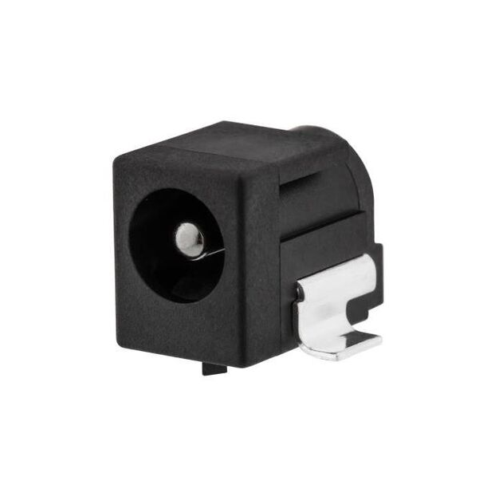
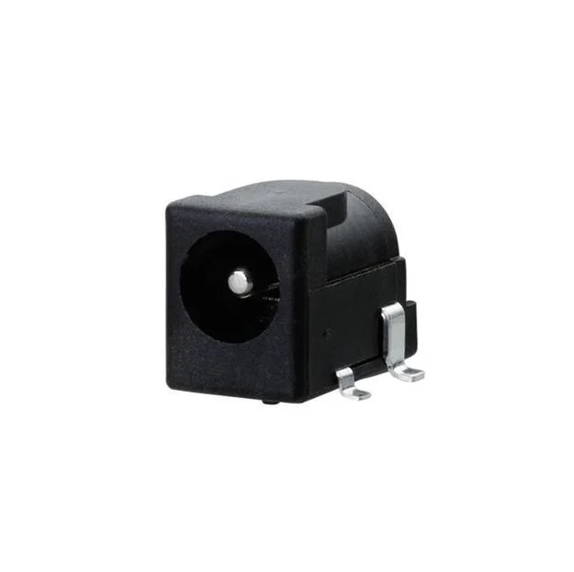
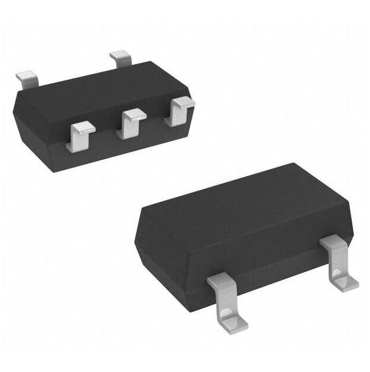

## Module's Selected Major Components

The following sections are the selected major components necessary for the rudder subsystem of Team 201.

### Power Management

(**remove this note/placeholder**: this is where your 3.3 volt switching regulator, any other needed power regulator, and power source {if applicable} **THAT WERE SELECTED**)

For more details, review the ["Appendix - Component Selection Process - Power Mangement"](https://embedded-systems-design.github.io/EGR314DataSheetTemplate/Appendix/01-Componet-Selection/Component-Selection-Process/#power-management) selection.

### Actuator

(**remove this note/placeholder**: if applicable, this is where your **Selected** the actuator items go, which includes both the driver and motor. Otherwise, remove this section.)

For more details, review the ["Appendix - Component Selection Process - Actuator"](https://embedded-systems-design.github.io/EGR314DataSheetTemplate/Appendix/01-Componet-Selection/Component-Selection-Process/#actuator) selection.

-----------

**Barrel Jack Adapter**

1. LDC-061DH-J-005-1AG-19

    

    * $1.23/each
    * [link to product](https://www.digikey.com/en/products/detail/linkplex/LDC-061DH-J-005-1AG-19/26798641)

    | Pros                                      | Cons                                                             |
    | ----------------------------------------- | ---------------------------------------------------------------- |
    | Larger solder pads for easier soldering   | Slightly more expensive                                          |
    | Lots of components in stock               | Will take up more space on PCB                                   |

2. LDC-016H-L-005-1AG-19

    

    * $1.11/each
    * [link to product](https://www.digikey.com/en/products/detail/linkplex/LDC-016H-L-005-1AG-19/26798684)

    | Pros                                      | Cons                                                             |
    | ----------------------------------------- | ---------------------------------------------------------------- |
    | Will take up less space on PCB            | Will need to check physical size of power supply                 |
    | Lots of components in stock               | Smaller solder pads                                              |
    | Slightly larger inner pin                 |

3. LDC-016H-J-005-1AG-19

    

    * $1.11/each
    * [link to product](https://www.digikey.com/en/products/detail/linkplex/LDC-016H-J-005-1AG-19/26798633)

    | Pros                                      | Cons                                                             |
    | ----------------------------------------- | ---------------------------------------------------------------- |
    | Larger solder pads for easier soldering   | Smaller solder pads                                              |
    | Lots of components in stock               | Slightly smaller inner pin                                       |

**Choice:** Option 2: LDC-016H-L-005-1AG-19

**Rationale:** I chose the second barrel jack because while it's price is the same as the third and only slightly lower than the first barrel jack adapter, it has a larger inner pin than the other 2 choices. This will allow for a tighter grip between the wall power supply and the PCB, to ensure there are no loose connections.

**3.3 V Switching Power Supply**

1. AZ1117IH-3.3TRG1

    

    * $0.24/each
    * [link to product](https://www.digikey.com/en/products/detail/diodes-incorporated/AZ1117IH-3-3TRG1/5699672)

    | Pros                                      | Cons                                                             |
    | ----------------------------------------- | ---------------------------------------------------------------- |
    | Inexpensive                               | Requires external components and support circuitry for interface |
    | Compatible with ESP32                     | Needs special PCB layout                                         |
    | 3.3 V and 1 A                             |

2. AS78L05RTR-E1

    

    * $0.13/each
    * [link to product](https://www.digikey.com/en/products/detail/diodes-incorporated/AS78L05RTR-E1/4470943)

    | Pros                                      | Cons                                                             |
    | ----------------------------------------- | ---------------------------------------------------------------- |
    | 1 output                                  | 5 V and 100 mA                                                   |
    | Stable over operating temperature         | 24 week manufacturer lead time                                   |
    | Extremely cheap                           |

3. TCR2EF33,LM(CT

    

    * $0.12/each
    * [link to product](https://www.digikey.com/en/products/detail/toshiba-semiconductor-and-storage/TCR2EF33-LM-CT/4503183)

    | Pros                                      | Cons                                                             |
    | ----------------------------------------- | ---------------------------------------------------------------- |
    | Large quantity in stock                   | 12 week manufacturer lead time                                   |
    | Stable over operating temperature         |
    | 3.3 V and 200 mA                          |

**Choice:** Option 3: TCR2EF33,LM(CT

**Rationale:** The current output may be less, but this regulator won't require a special PCB layout and won't take 24 weeks to be shipped. 

**Motor Drivers**

1. 

    

    * $/each
    * [link to product]()

    | Pros                                      | Cons                                                             |
    | ----------------------------------------- | ---------------------------------------------------------------- |
    | Larger solder pads for easier soldering   | Slightly more expensive                                          |
    | Lots of components in stock               | Will take up more space on PCB                                   |

2. 

    

    * $1.11/each
    * [link to product]()

    | Pros                                      | Cons                                                             |
    | ----------------------------------------- | ---------------------------------------------------------------- |
    | Will take up less space on PCB            | Will need to check physical size of power supply                 |
    | Lots of components in stock               | Smaller solder pads                                              |
    | Slightly larger inner pin                 |

3. 

    

    * $1.11/each
    * [link to product]()

    | Pros                                      | Cons                                                             |
    | ----------------------------------------- | ---------------------------------------------------------------- |
    | Larger solder pads for easier soldering   | Smaller solder pads                                              |
    | Lots of components in stock               | Slightly smaller inner pin                                       |

**Choice:** Option : 

**Rationale:** 

**9 V stepper motors**

1. 

    

    * $/each
    * [link to product]()

    | Pros                                      | Cons                                                             |
    | ----------------------------------------- | ---------------------------------------------------------------- |
    | Larger solder pads for easier soldering   | Slightly more expensive                                          |
    | Lots of components in stock               | Will take up more space on PCB                                   |

2. 

    

    * $1.11/each
    * [link to product]()

    | Pros                                      | Cons                                                             |
    | ----------------------------------------- | ---------------------------------------------------------------- |
    | Will take up less space on PCB            | Will need to check physical size of power supply                 |
    | Lots of components in stock               | Smaller solder pads                                              |
    | Slightly larger inner pin                 |

3. 

    

    * $1.11/each
    * [link to product]()

    | Pros                                      | Cons                                                             |
    | ----------------------------------------- | ---------------------------------------------------------------- |
    | Larger solder pads for easier soldering   | Smaller solder pads                                              |
    | Lots of components in stock               | Slightly smaller inner pin                                       |

**Choice:** Option : 

**Rationale:** 